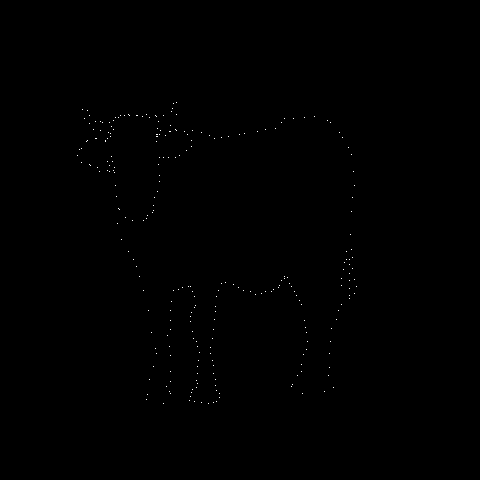
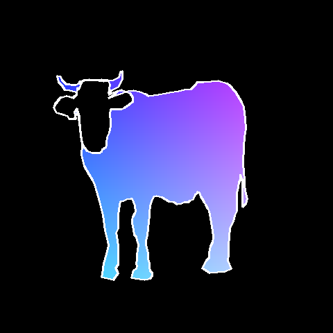

# Harel Cohen - Next Py Assignments
### Unit 6 - Connect the dots
מומלץ ללכת לראות את הקוד 🐮

  

עבדתי על משימות אלו במהלך הקורס Next.py של קמפוס IL.  
הפרויקט כתוב כולו בפייתון ומציג את הפתרונות למשימות במהלך הקורס.  
הקוד עומד בסטנדרטים שלי בכתיבת קוד יפה קריא ומתועד, שאינו מסורבל ועובד ביעילות.

##

  
  

